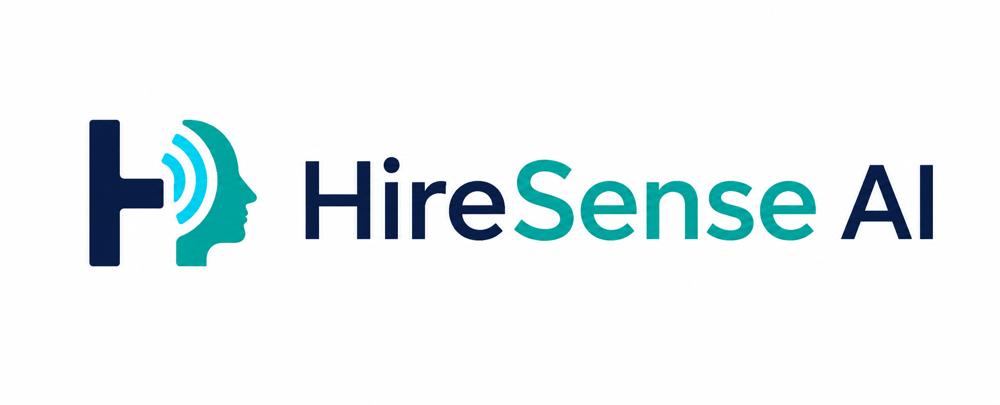

# HireSense AI




[](LICENSE)
[](https://www.python.org/)
[](https://hiresenseay.streamlit.app/)

HireSense AI is an open-source Streamlit interview-practice application. It
combines resume and job-description context, adaptive questions, a
conversational live voice mode, transcript-verified competency scoring,
skill-gap analysis, and transparent practice analytics.

**[Try the live app](https://hiresenseay.streamlit.app/)** ·
**[Read the setup guide](docs/DEPLOYMENT.md)** ·
**[Contribute](CONTRIBUTING.md)** ·
**[Report a security issue](SECURITY.md)**

> [!IMPORTANT]
> HireSense AI is designed for interview practice and educational use. It is
> not a validated hiring-decision system. Do not use facial appearance,
> inferred emotion, accent, or other biometric signals to make employment
> decisions. Read [Privacy and responsible use](docs/PRIVACY_AND_RESPONSIBLE_USE.md)
> before deploying it for other people.

This repaired build does not generate substitute emotion values. If the
camera, face detector, or trained model is unavailable, the reading remains
`N/A`.

## Polished Streamlit experience

- One cohesive HireSense design system across setup, interviews, reports,
  history, skill analysis, coaching, and coding practice.
- The supplied HireSense AI logo appears consistently in the workspace,
  authentication gate, interview room, browser icon, and mobile wrapper.
- OpenRouter model features default to `deepseek/deepseek-v4-flash`.
- Responsive deep-navy interface with accessible contrast, indigo actions,
  cyan accents, consistent cards, and calmer spacing.
- Four-part interview setup that groups focus, role context, experience, and
  final review.
- Focused interview room that hides workspace navigation during a session.
- Redesigned live voice panel with a local animated AI interviewer, clear
  question hierarchy, editable transcript, and accessible controls.
- Cleaner evidence report and interview-history presentation.
- Supabase Google OAuth and email Auth with RLS-protected cloud history across
  browsers and devices.
- Automatic unfinished-interview detection with confirmed-turn recovery.
- Technical connection details are hidden from candidates and only appear when
  developer mode is enabled.
- Reduced-motion support and mobile layouts are included.

## What is fixed

- The four-part setup progress indicator renders as one responsive grid without
  exposing its HTML source.
- The browser now loads the converted version of the supplied trained Keras
  model.
- The unrelated untrained TensorFlow.js model was removed.
- Random, sine-wave, brightness, and fixed 50% fallbacks were removed.
- Camera results now return to Streamlit through a real bidirectional custom
  component.
- Voice transcripts now return directly to Streamlit instead of relying on
  ignored `postMessage` calls or local-storage timing.
- Questions are always shown on screen and use a visible browser audio button,
  so autoplay restrictions can no longer make an interview silently stall.
- The voice component keeps one browser session across questions, preserving
  audio activation and microphone permission.
- The HireSense Interview Engine performs its first four analysis stages
  locally and makes only one OpenRouter call to generate each base question.
- Empty, invalid, timed-out, or failed model responses use a clearly disclosed
  built-in backup question instead of leaving the interview blank.
- Live voice mode streams a correctable transcript, uses browser-side adaptive
  voice activity detection, and normally submits about one second after the
  candidate finishes speaking.
- Maya, the clearly labelled HireSense AI interviewer, reacts to Ready,
  Speaking, Listening, Thinking, Paused, audio-error, and offline states.
- Candidates can interrupt Maya while a question is being spoken. HireSense
  stops playback and starts listening without losing the visible question.
- If browser speech playback fails, the complete written question is focused
  and the microphone or editable transcript remains available.
- The first question starts generating on **Start interview**, and each next
  base question is prefetched while the candidate answers, so provider
  generation time is usually hidden behind speaking time.
- Interactive prompts use compact locally extracted profile facts and bounded
  recent history instead of resending full documents every turn.
- Follow-ups are selected from missing context, ownership, results, or
  reasoning. They are no longer chosen randomly.
- The live panel always shows Ready, Listening, Processing, Speaking, Paused,
  or Connection lost.
- Accessibility controls include captions, question replay and rephrasing,
  language selection, slower or faster speech, extra response time, manual
  submission, keyboard focus styles, and reduced-motion support.
- Response-length and facial-signal grades were removed. The evidence
  assessment uses seven competency dimensions and accepts a score only when an
  exact cited excerpt is verified against the candidate transcript.
- Missing facial data stays unavailable in dashboards and reports.
- Facial signals and response length have 0% weight in competency scoring.
- The optional facial signal does not change question difficulty or follow-up
  selection.
- Supabase Google sign-in uses browser PKCE and exchanges the callback for a
  Supabase JWT, so social accounts receive the same RLS protection as email
  accounts.
- OAuth callback codes and flow identifiers are bounded and validated. Google
  provider tokens are neither requested nor retained.
- Resume, job-description, language, and history persistence is namespaced per
  signed-in user.
- Supabase stores normalized profiles, jobs, applications, interviews,
  confirmed turns, and evidence scores when configured.
- Database writes run outside the live voice response path, with the browser
  store retained as a temporary fallback.
- Original resume PDFs are uploaded to a private bucket only after explicit
  candidate selection.
- Browser script values are escaped against script-tag injection.
- The dev-container no longer disables XSRF protection.
- Features without a real execution backend are labelled honestly.
- Runtime and maintainer dependencies are separated.
- Automated model-integrity, analytics, auth, component, and security tests
  are included.

## Requirements

- Python 3.11 or 3.12
- A current Chrome, Edge, or Chromium browser for the best camera and Web
  Speech API support
- An OpenRouter API key for generated questions, analysis, and scoring
- Node.js 20.19 or newer only if rebuilding browser components

Camera access generally requires HTTPS in production. `localhost` is accepted
by current browsers for development.

## Quick start

```bash
python -m venv .venv
source .venv/bin/activate
python -m pip install --upgrade pip
python -m pip install -r requirements.txt
cp .env.example .env
```

Edit `.env` and set:

```dotenv
OPENROUTER_API_KEY=your_real_key
OPENROUTER_MODEL=deepseek/deepseek-v4-flash
HIRESENSE_AUTH_REQUIRED=false
```

For secure cross-device persistence, also set:

```dotenv
SUPABASE_URL=https://your-project-ref.supabase.co
SUPABASE_PUBLISHABLE_KEY=your_public_publishable_key
HIRESENSE_SUPABASE_AUTH_REQUIRED=true
HIRESENSE_GOOGLE_AUTH_ENABLED=true
SUPABASE_OAUTH_REDIRECT_URL=https://your-app.streamlit.app/
```

Run both included migrations in timestamp order before enabling Supabase. See
[`docs/SUPABASE_SETUP.md`](docs/SUPABASE_SETUP.md).

Then run:

```bash
streamlit run app.py
```

Open `http://localhost:8501`.

On Windows PowerShell, activate the environment with:

```powershell
.venv\Scripts\Activate.ps1
```

## Free deployment

The project is ready for Streamlit Community Cloud and includes compiled
browser components, models, dependencies, and theme configuration. Follow
[`docs/DEPLOYMENT.md`](docs/DEPLOYMENT.md) for the GitHub setup, secrets,
deployment, and production verification checklist.

## Configuration

| Variable | Required | Purpose |
|---|---:|---|
| `OPENROUTER_API_KEY` | For model features | Interview, feedback, and skill-analysis LLM calls |
| `OPENROUTER_MODEL` | No | Question and supporting AI model; defaults to `deepseek/deepseek-v4-flash` |
| `OPENROUTER_EVALUATION_MODEL` | No | Evidence evaluator; defaults to `deepseek/deepseek-v4-flash` |
| `OPENROUTER_TIMEOUT_SECONDS` | No | Per-request timeout; defaults to 45 seconds |
| `OPENROUTER_MAX_RETRIES` | No | Retry count; defaults to 2 |
| `OPENROUTER_QUESTION_TIMEOUT_SECONDS` | No | Interactive question timeout; defaults to 8 seconds before disclosed fallback |
| `OPENROUTER_QUESTION_MAX_RETRIES` | No | Interactive question retries; defaults to 0 to avoid long stalls |
| `OPENROUTER_FOLLOWUP_TIMEOUT_SECONDS` | No | Interactive follow-up timeout; defaults to 8 seconds |
| `OPENROUTER_INTERACTIVE_REASONING_EFFORT` | No | Reasoning effort for spoken questions and follow-ups; defaults to `none` for speed |
| `HIRESENSE_PREFETCH_WAIT_SECONDS` | No | Maximum hand-off wait for an in-flight prefetched question; defaults to 1.25 seconds |
| `SUPABASE_URL` | For cloud persistence | Supabase project URL |
| `SUPABASE_PUBLISHABLE_KEY` | For cloud persistence | Public publishable key used with Row Level Security |
| `SUPABASE_ANON_KEY` | No | Legacy public key fallback when no publishable key is set |
| `HIRESENSE_SUPABASE_AUTH_REQUIRED` | No | Requires Supabase sign-in when cloud persistence is configured; defaults to `true` |
| `HIRESENSE_GOOGLE_AUTH_ENABLED` | No | Shows Supabase Google sign-in; defaults to `true` when Supabase Auth is active |
| `SUPABASE_OAUTH_REDIRECT_URL` | Recommended for Google | Exact deployed app URL allowed in Supabase Auth Redirect URLs |
| `HIRESENSE_AUTH_REQUIRED` | No | Legacy standalone Google flow; keep `false` when Supabase Auth is enabled |
| `GOOGLE_CLIENT_ID` | Legacy auth only | Not used by Supabase Google sign-in |
| `GOOGLE_CLIENT_SECRET` | Legacy auth only | Never add this when using Supabase Google sign-in |
| `GOOGLE_REDIRECT_URI` | Legacy auth only | Callback for the standalone legacy flow |
| `HIRESENSE_SESSION_SECRET` | Legacy auth only | Signs standalone OAuth browser sessions |
| `LANGCHAIN_API_KEY` | No | Optional LangSmith tracing |
| `LANGCHAIN_TRACING_V2` | No | Enables or disables tracing |
| `HIRESENSE_DEVELOPER_MODE` | No | Shows a clearly labelled manual test override |

Only the legacy standalone auth path needs its own signing secret:

```bash
python -c "import secrets; print(secrets.token_urlsafe(48))"
```

Do not commit `.env`.

## HireSense Interview Engine

The interview engine has five visible stages:

1. Content Agent parses the supplied resume and job description locally.
2. Insight Agent matches explicit skills and ranks gaps from JD wording.
3. Impact Agent selects JD-backed interview priorities.
4. Strategy Agent chooses tone, difficulty, and focus.
5. Execution Agent makes the only OpenRouter call and asks one question.

The first four stages are cached per interview session and do not wait for
network responses. Each model prompt receives compact extracted facts and
bounded recent history. If the final model call fails or returns no valid
question, the app labels and uses a deterministic built-in question so the
session can continue.

## Live voice flow

1. Select **Start interview** once to activate browser audio and microphone
   permission.
2. Maya, the HireSense AI interviewer, speaks the visible question. Her
   animation runs locally and adds no network latency.
3. Browser speech recognition streams words into an editable transcript.
4. The candidate can interrupt Maya, correct the transcript, pause, replay, or
   rephrase the question.
5. Adaptive voice activity detection normally submits about 900 ms after the
   candidate finishes. Fixed silence periods and manual submission remain
   available.
6. A local evidence-gap check decides whether one targeted follow-up is useful.
7. The next base question has already been generating while the candidate
   speaks, and is handed to the same browser component when ready.

Speech playback start, end, pause, resume, and error events drive the
interviewer state. When playback is blocked or unavailable, HireSense shows a
clear text fallback and continues the interview instead of waiting silently.

Browser-native speech recognition is used rather than raw-audio WebRTC
streaming. Availability and transcription processing depend on the browser and
operating system. Web Audio volume samples are processed only inside the
browser while Listening for end-of-speech detection, and are not stored or
sent to HireSense.

## Evidence-based scoring

The final assessment uses these dimensions:

- Relevance
- Specificity
- Demonstrated skills
- Reasoning quality
- Ownership and self-awareness
- Communication clarity
- Evidence of results

The evaluator returns a 1 to 5 score, reason, answer index, and exact excerpt
for each supported dimension. HireSense validates every excerpt against the
candidate transcript. If the excerpt cannot be verified, that dimension shows
**Insufficient evidence** and receives no score. The report also shows scoring
coverage and deterministic reliability labels.

See `docs/LIVE_VOICE_AND_SCORING.md` for the full turn flow, accessibility
controls, scoring validation, and technical boundaries. See
`docs/LATENCY.md` for the optimized turn path, timing configuration, diagnostics,
and realistic performance targets.

## Trained browser model

The source model is:

```text
models/viva_defense_final.keras
```

The app loads its TensorFlow.js GraphModel export from:

```text
static/emotion_model/model.json
```

Face localization uses the packaged Tiny Face Detector assets under
`static/face_models/`. Streamlit static-file serving is enabled in
`.streamlit/config.toml`.

The browser pipeline is:

1. Detect one face.
2. Add a small crop margin.
3. Resize the crop to 48 by 48 pixels.
4. Convert it to one grayscale channel.
5. Normalize pixels to the range 0 through 1.
6. Run the trained GraphModel.
7. Median-smooth the latest nine valid model outputs.
8. Return the measured value and explicit status to Python.

There is no random, brightness-based, or fixed-value fallback.

The output is an optional experimental facial stress signal. It is excluded
from evidence scoring and is not suitable for a hiring decision. The archive
does not contain the model's training dataset or calibration study, so do not
present the number as a calibrated probability.
See `docs/MODEL_INTEGRITY.md` for verification details.

## Tests

Install development dependencies and run:

```bash
python -m pip install -r requirements-dev.txt
pytest -q
ruff check .
```

Verify the actual GraphModel in TensorFlow.js:

```bash
cd emotion_detector/frontend
npm install
npm run verify:model
```

The verification script checks known black-frame and white-frame outputs and
fails if the model becomes constant or its export changes unexpectedly.

## Rebuilding browser components

Built assets are included, so normal users do not need Node.js.

```bash
cd emotion_detector/frontend
npm install
npm run build

cd ../../voice_input/frontend
npm install
npm run build

cd ../../persistence/frontend
npm install
npm run build
```

Do not package `node_modules`.

## Re-converting the Keras model

This is a maintainer operation. Only run unsafe Keras deserialization on the
trusted model bundled with this project.

```bash
python -m pip install -r scripts/requirements-model-conversion.txt
python scripts/convert_emotion_model.py
cd emotion_detector/frontend
npm run verify:model
```

The conversion script repairs missing Lambda output-shape metadata in a
temporary copy. It does not alter the source `.keras` file.

## Feature boundaries

- Text and live voice interviews use real OpenRouter calls.
- Browser speech recognition availability depends on the browser and operating
  system. Some browsers may process speech through their vendor service.
- The facial model runs locally in the browser after static assets load.
- Live coaching shows structural templates for detected question types. It
  does not claim those templates are live LLM responses.
- The coding area is an editor and whiteboard. It does not execute code.
- Session video recording and non-verbal video scoring are disabled in this
  repaired build because the previous implementation could not preserve video
  blobs safely across Streamlit reruns.
- With Supabase configured, confirmed interview data is stored in the user's
  RLS-protected account and browser persistence acts as a temporary fallback.
- Without Supabase configured, persistence remains local to the device and
  browser profile.

## Project structure

```text
HireSense_AI/
├── app.py
├── auth.py
├── supabase_auth.py
├── supabase_backend.py
├── database.py
├── analytics_dashboard.py
├── evidence_scoring.py
├── hiresense_agent.py
├── interview_arena.py
├── latency_optimizer.py
├── webcam_component.py
├── voice_input_component.py
├── persistence_component.py
├── LICENSE
├── CONTRIBUTING.md
├── SECURITY.md
├── requirements.txt
├── requirements-dev.txt
├── pyproject.toml
├── .streamlit/config.toml
├── models/
│   └── viva_defense_final.keras
├── static/
│   ├── emotion_model/
│   └── face_models/
├── emotion_detector/frontend/
├── voice_input/frontend/
├── persistence/frontend/
├── scripts/
│   ├── convert_emotion_model.py
│   └── requirements-model-conversion.txt
├── tests/
├── supabase/
│   └── migrations/
├── docs/
│   ├── LATENCY.md
│   ├── LIVE_VOICE_AND_SCORING.md
│   ├── DEPLOYMENT.md
│   ├── SUPABASE_SETUP.md
│   ├── MODEL_INTEGRITY.md
│   ├── ARCHITECTURE.md
│   └── PRIVACY_AND_RESPONSIBLE_USE.md
└── mobile/
```

## Mobile wrapper

The optional wrapper uses Expo SDK 57 and loads a deployed HireSense URL. Copy `mobile/.env.example`
to `mobile/.env` and set:

```dotenv
EXPO_PUBLIC_HIRESENSE_URL=https://your-deployment.example/
```

Then install and start it from `mobile/`:

```bash
npm install
npm start
```

The wrapper pins the patched `uuid` release through its package override. Its
current production dependency audit reports zero known vulnerabilities.

## Contributing

Bug reports, documentation improvements, tests, accessibility fixes, and
carefully scoped features are welcome. Start with
[`CONTRIBUTING.md`](CONTRIBUTING.md), then open an issue or pull request.

Please review the [Code of Conduct](CODE_OF_CONDUCT.md) and
[Security Policy](SECURITY.md) before contributing.

## License

HireSense AI is released under the [MIT License](LICENSE). Third-party
packages and bundled third-party assets retain their own licenses. See
[`THIRD_PARTY_NOTICES.md`](THIRD_PARTY_NOTICES.md).
