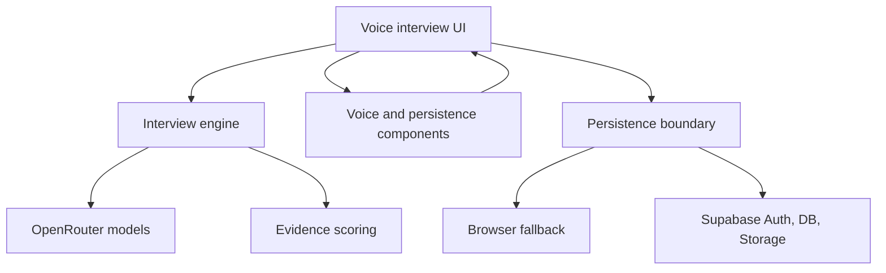

# Architecture

HireSense AI is a Streamlit application focused on one public workflow: a
personalized Live Voice Interview. It uses browser speech components and an
optional Supabase backend while keeping model and database work bounded or
asynchronous.

## Main layers

| Layer | Main files | Responsibility |
|---|---|---|
| Application shell | `app.py`, `ui_theme.py` | Voice-only setup, session state, and feedback |
| Interview orchestration | `hiresense_agent.py`, `interview_arena.py`, `followup_questions.py` | Context extraction, question selection, bounded follow-ups |
| Voice interview | `live_voice_interview.py`, `voice_input_component.py` | Interview lifecycle and browser voice bridge |
| Evidence | `evidence_scoring.py` | Transcript-grounded feedback |
| Auth and persistence | `supabase_auth.py`, `supabase_backend.py`, `database.py` | RLS identity, cloud records, recovery, deletion |
| Browser fallback | `persistence_component.py` | Namespaced session backup and OAuth recovery data |
| Legacy modules | Camera, coding, coaching, skill, and analytics modules | Retained for migration reference but unreachable from the public router |

## Browser components

Each component keeps source and a compiled `dist` directory:

- `voice_input/frontend`: speech playback, recognition, editable transcript,
  timing controls, and Maya's local animation
- `persistence/frontend`: browser storage, Supabase PKCE session handling, and
  Google OAuth handoff
- `emotion_detector/frontend`: local face detection and model execution

Compiled bundles are committed because Streamlit Community Cloud does not build
Node projects during a normal deployment.

## Interview data flow

1. The candidate uploads a resume, pastes a job description, and can
   optionally change the interview language.
2. Local extraction creates compact role and candidate context.
3. The engine asks OpenRouter for one bounded question.
4. The browser speaks the visible question and captures an editable
   transcript.
5. Only a submitted, confirmed answer enters interview history.
6. A background persistence queue stores the confirmed turn when Supabase is
   configured.
7. Final evidence scoring cites exact transcript excerpts or reports
   insufficient evidence.
8. Browser persistence remains a temporary fallback if cloud sync fails.

## Security boundaries

- Candidate-controlled text is separated from system instructions.
- The app uses a Supabase publishable key plus the signed user's JWT.
- A service-role key is never required by the application.
- Row Level Security is defined by the migrations under `supabase/migrations`.
- Google client secrets stay in Supabase provider settings.
- Partial speech transcripts and microphone samples are not persisted.
- Webcam, recording, nonverbal, coding, coaching, history, and skill-analysis
  routes are disabled in the public product.

## Safe extension points

- Add languages through `language_support.py` and matching browser locale
  handling.
- Add competency dimensions only when evidence can be verified against exact
  transcript text.
- Add database fields through a new timestamped migration rather than editing
  a migration that may already be deployed.
- Rebuild and commit a component's `dist` output whenever its source changes.
